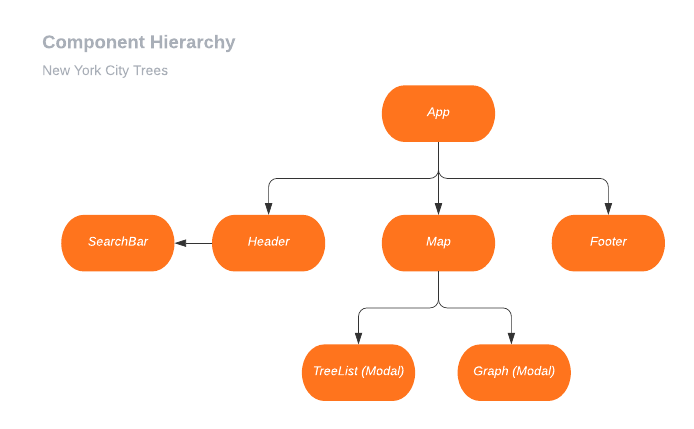

***Mick Roth***

# New York City Trees

This is a create-react-app project using NYC Open Data to map the trees of New York City. Users can search by address, neighborhood, and zipcode. Results are categorized by species and displayed on the map.
 

### &#127794; Technologies	
- React
- Sass
- React Router
- React Auto Complete
- React Mapbox GL
- AM Chart
- Iconify

 

### &#127796; Diagrams
- [Wireframes](https://whimsical.com/BnbY2ct8WMQEhX3Bvd79Zm)
  
 

 

### &#127795; Deployed
- [Current Site](https://psychedelic-plantation.surge.sh)

- [1.0.0](http://nyc-trees.surge.sh/)

 

### &#127807; API 
- [2105 Street Tree Census Data](https://data.cityofnewyork.us/Environment/2015-Street-Tree-Census-Tree-Data/pi5s-9p35)
- [API Docs](https://dev.socrata.com/foundry/data.cityofnewyork.us/5rq2-4hqu)

